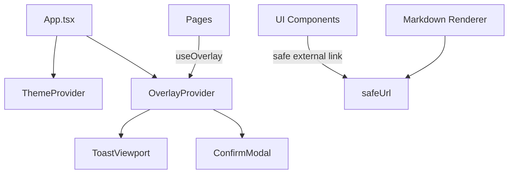

# 技术设计: UI/UX 进化（Overlay交互 + 主题切换 + 链接安全）

## 技术方案

### 核心技术
- React Context + Portal：实现全局Overlay（Toast/Confirm）
- Framer Motion：弹层与Toast的微交互动效（自动尊重 `prefers-reduced-motion`）
- localStorage：主题偏好持久化（system/dark/light）
- URL scheme 白名单：为外链与Markdown链接提供防线

### 实现要点
- OverlayProvider 暴露 `toast()` 与 `confirm()`：页面只关心“要提示/要确认”，不关心呈现细节。
- Confirm 采用队列：避免并发确认导致覆盖/丢失。
- 主题通过 `data-theme` 作用于 `:root`：最小侵入当前CSS变量体系，并与 `prefers-color-scheme` 协同。
- 链接校验函数放入 `lib/`：同一逻辑复用于 Markdown 与外链按钮。

## 架构设计

## 架构决策 ADR

### ADR-001: 站内Overlay替代window.alert/confirm
**上下文:** 多页面存在阻塞弹窗，视觉割裂且不可控；同时无障碍与移动端体验欠佳。  
**决策:** 引入 OverlayProvider（Toast + Confirm），并逐步替换所有 `window.alert/confirm`。  
**理由:** 统一视觉语言、降低阻塞交互、提升可访问性与可维护性。  
**替代方案:** 使用第三方弹层库（如 Radix UI） → 拒绝原因: 依赖与样式体系引入成本更高，当前项目已有成熟视觉基础。  
**影响:** 需要在多页面改动调用方式；需关注焦点管理与ESC冲突。

## 安全与性能
- **安全:** 外链与Markdown链接做scheme白名单；外链统一 `rel="noopener noreferrer"`。
- **性能:** Toast/Confirm 只在需要时渲染；Confirm队列避免重复创建；动画尊重 reduced-motion。

## 测试与部署
- **测试:** `npm run lint`、`npm run build`；安全审计 `npm audit --registry https://registry.npmjs.org/`。
- **部署:** 不变：GitHub Actions 构建 `dist/` 并发布 Pages。

