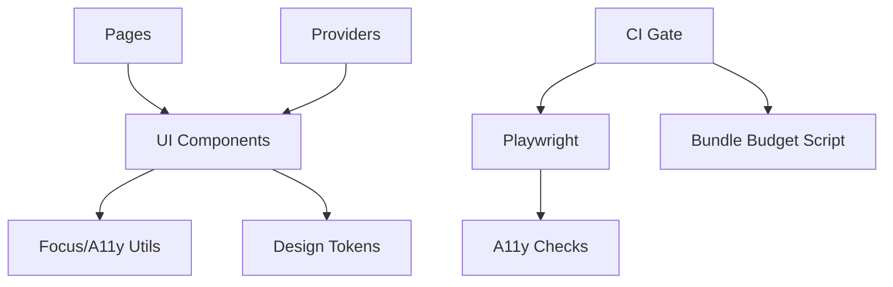

# 技术设计: capstone-delivery（封顶交付）

## 技术方案

### 核心技术
- React 19 + React Router（HashRouter）
- Vite 7 + TypeScript（`tsc -b`）
- Tailwind CSS（设计 token + utility）
- Vitest + Testing Library（单测）
- Playwright（e2e）
- （拟引入）A11y 扫描：基于 Playwright 的 axe 检查

### 实现要点
- **Design System 强化**
  - 统一 focus-ring、disabled、active、loading 等视觉语义
  - 为弹层/菜单/命令面板抽象通用的可访问性与焦点管理能力
- **Reduced Motion / 降级策略**
  - 在 `prefers-reduced-motion: reduce` 下：降低或关闭高频/大面积动画与高成本效果
  - 对背景/玻璃效果采用“首屏克制、交互后增强”的策略，并补齐降级分支
- **A11y Gate**
  - e2e 里对关键页面执行 axe 扫描并作为 CI 门禁（仅限 serious/critical）
  - 关键键盘路径（Tab/ESC/快捷键）以 e2e 覆盖
- **Performance Budget**
  - 构建后扫描 `dist/assets` 的 gzip 体积并输出报告
  - 在 CI 中作为门禁，超预算失败并给出定位提示

## 架构设计
本轮以“基础能力抽象”为主：把跨页面复用的交互（弹层/菜单/焦点管理/动效降级/预算线）下沉到 `components/` 与 `lib/`，页面文件只保留业务组合。

## 架构决策 ADR

### ADR-001: 引入 A11y 自动门禁
**上下文:** 仅靠肉眼 review 难以持续保证弹层/菜单/命令面板的可访问性与键盘一致性，且回归隐蔽。
**决策:** 在 Playwright e2e 中加入 axe 扫描，对关键页面/弹层做 serious/critical 级别门禁。
**理由:** 低成本、可复现、能直接定位问题；与现有 e2e 管线一致，失败时可上传工件辅助排障。
**替代方案:** 仅做人工 checklist → 拒绝原因: 无法形成长期自动化保障，容易在迭代中回归。
**影响:** CI 执行时间略增；需要维护少量规则与白名单（如有必要）。

### ADR-002: 引入 Bundle Size Budget 门禁
**上下文:** 静态站点的“顺”高度依赖包体积与切分策略；缺少预算线会在迭代中逐步变慢而不自知。
**决策:** 构建后对关键 gzip 体积设预算线，CI 超预算直接失败。
**理由:** 简单可解释；能把性能问题前置，避免“上线后才变慢”的被动修复。
**替代方案:** 仅依赖 Lighthouse 手工跑分 → 拒绝原因: 手工不可持续且结果受环境波动影响大。
**影响:** 需要维护预算值；首次落地应宽松，后续再逐步收紧。

## 安全与性能
- **安全:** 延续 URL scheme 白名单与 `rel="noopener noreferrer"`；导入导出严格做结构校验与异常兜底。
- **性能:** 降低首屏合成与重绘压力；减少不必要的 re-render；预算线避免体积膨胀。

## 测试与部署
- **测试:**
  - Vitest：补齐 `routes/prefetch.ts` 与关键 UI 组件的单测
  - Playwright：扩展关键链路，并加入 a11y 扫描与失败工件策略
- **部署:** 维持 GitHub Actions → GitHub Pages；在部署前执行完整门禁（lint/test/build/e2e/a11y/budget）。

