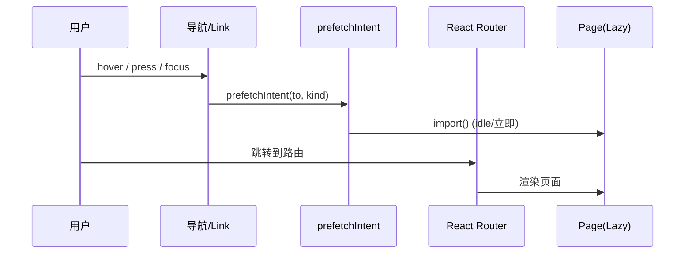

# 架构设计

## 总体架构

```mermaid
flowchart TD
    U[用户/浏览器] -->|访问| P[GitHub Pages 静态资源]
    P --> A[React App]

    subgraph Runtime[运行时(浏览器)]
      A --> R[HashRouter + AppRouter]
      A --> Theme[ThemeProvider]
      A --> Overlay[OverlayProvider]
      A --> C[AppChrome(TopNav/Footer/Backdrop)]
      R --> Pages[Pages]
      Pages --> UI[UI Components]
      Pages --> Content[Content 数据(静态TS)]
      Pages --> Storage[localStorage/sessionStorage]
      Pages --> Motion[Framer Motion]
      Pages --> Prefetch[prefetch/lazy/idle]
      Overlay --> Toast[ToastViewport]
      Overlay --> Confirm[ConfirmModal]
    end
```

---

## 技术栈
- **前端:** React 19 + TypeScript 5.9 + Vite 7
- **路由:** React Router（HashRouter）
- **样式:** Tailwind CSS 3.4 + Typography
- **动效:** Framer Motion
- **部署:** GitHub Actions → GitHub Pages（产物 `dist/`）

---

## 核心流程

### 页面导航 + 预取（Prefetch）



### 本地优先（Local-first）
- 收藏、札记、批注等写入 localStorage，确保刷新不丢。
- 页面内“阅读进度/滚动位置”等短期状态写入 sessionStorage。

---

## 重大架构决策

完整的ADR存储在各变更的 `how.md` 中，本章节提供索引。

| adr_id | title | date | status | affected_modules | details |
|--------|-------|------|--------|------------------|---------|
